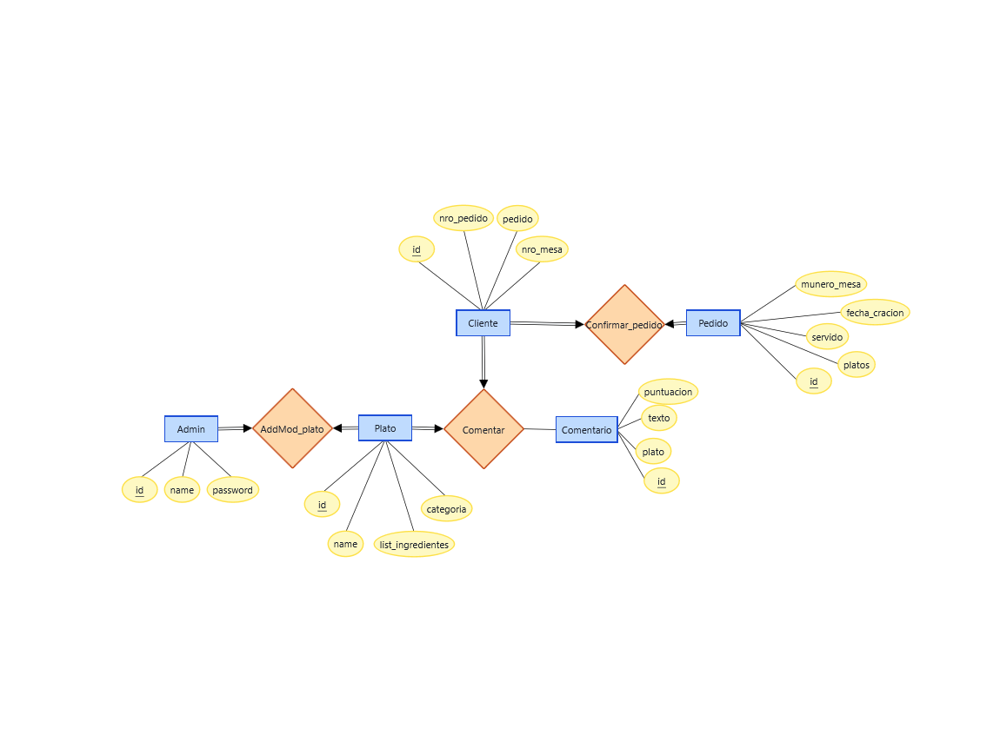

El sistema de toma de pedidos (STP) busca implementar una ayuda visual a la hora de pedir comida en un local, implementando una lista de platos los cuales pueden ser mostrados y así asegurar que al cliente no se olvide de pedir nada.

## Funcionalidad:

En la primera vista se selecciona uno de los roles de usuario: cliente o administrador.
Desde la vista del administrador se pueden crear o modificar platos del menú.
Desde la vista del cliente se muestra el menú con los platos agregados por el administrador, donde se puede agregar una cantidad arbitraria de cada plato, junto con mostrar sus ingredientes, su precio y una lista de reseñas con la calificación promedio del plato.

Una vez entregado el pedido, se puede ver todo lo agregado junto con el precio total, además de una opción para agregar una reseña a cada uno de los platos incluidos en el pedido.

## Como runnear el server:

Desde el directorio raíz del proyecto, ubicarse en la carpeta padre con el siguiente comando:

> cd STP

Una vez ahí, en la consola se debe escribir:

> python manage.py runserver

y se podrá acceder a la view principal de la página a través del link:

http://127.0.0.1:8000

## Puntos Importantes:

-> Enfoque en funcionalidad antes que estética, obviando mensajes por ejemplo de éxito/error en las operaciones ("Credenciales inválidas", "Pedido añadido con éxito", entre otras)

-> Bug existente a la hora de retroceder hacia la página de ingreso de credenciales para el administrador.

## Modelo Entidad Relacion:

